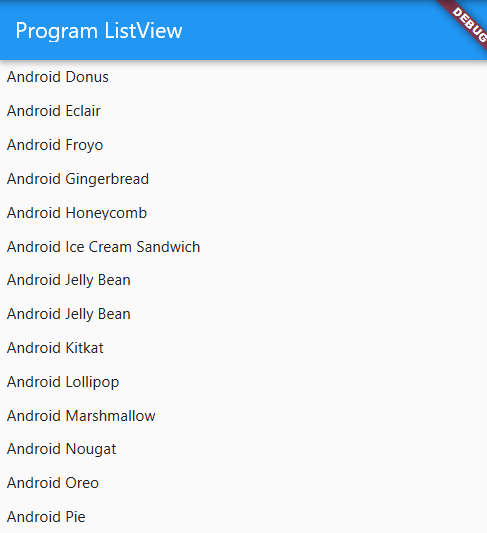

## LISTVIEW

Listview merupakan wiget yang digunakan untuk menampilkn data secara dynamis, serta dapat juga menmpilkan data dari array dan sumber lain seperti database dengan menggunakan perintah yang tersimpan daam json.
dalam artikel ini kita akan coba step by step mempraktekan lisview, Langkah pertama siapkan terlebih dahulu class yang dijadikan tempat meletakkan ListView
>##Program Dasar
```Dart
import 'package:flutter/material.dart';

void main() => runApp(MyApp());

class MyApp extends StatelessWidget {
  Widget build(BuildContext context) {
    return MaterialApp(
      home: Scaffold(
        appBar: AppBar(
          title: Text('Program ListView'),
        ),
        //Program Lisview
      ),
    );
  }
}

```
>## Contoh Mebuat ListView Sederhana
perintah dibawah ini menggunkan item padding

```dart
        body: ListView(
        children: <Widget>[
          Padding(
            padding: EdgeInsets.all(8.0),
            child: Text("Android Cupcake",style:TextStyle(fontSize:20.00,)),
          ),
          Padding(
            padding: EdgeInsets.all(8.0),
            child: Text("Android Donus"),
          ),
          Padding(
            padding: EdgeInsets.all(8.0),
            child: Text("Android Eclair"),
          ),
          Padding(
            padding: EdgeInsets.all(8.0),
            child: Text("Android Froyo"),
          ),
          Padding(
            padding: EdgeInsets.all(8.0),
            child: Text("Android Gingerbread"),
          ),
          Padding(
            padding: EdgeInsets.all(8.0),
            child: Text("Android Honeycomb"),
          ),
          Padding(
            padding: EdgeInsets.all(8.0),
            child: Text("Android Ice Cream Sandwich"),
          ),
          Padding(
            padding: EdgeInsets.all(8.0),
            child: Text("Android Jelly Bean"),
          ),
          Padding(
            padding: EdgeInsets.all(8.0),
            child: Text("Android Jelly Bean"),
          ),
          Padding(
            padding: EdgeInsets.all(8.0),
            child: Text("Android Kitkat"),
          ),
          Padding(
            padding: EdgeInsets.all(8.0),
            child: Text("Android Lollipop"),
          ),
          Padding(
            padding: EdgeInsets.all(8.0),
            child: Text("Android Marshmallow"),
          ),
          Padding(
            padding: EdgeInsets.all(8.0),
            child: Text("Android Nougat"),
          ),
          Padding(
            padding: EdgeInsets.all(8.0),
            child: Text("Android Oreo"),
          ),
          Padding(
            padding: EdgeInsets.all(8.0),
            child: Text("Android Pie"),
          ),
        ],
      ),
      
```



### Markdown

Markdown is a lightweight and easy-to-use syntax for styling your writing. It includes conventions for

```markdown
Syntax highlighted code block

# Header 1
## Header 2
### Header 3

- Bulleted
- List

1. Numbered
2. List

**Bold** and _Italic_ and `Code` text

[Link](url) and 
```

For more details see [GitHub Flavored Markdown](https://guides.github.com/features/mastering-markdown/).

### Jekyll Themes

Your Pages site will use the layout and styles from the Jekyll theme you have selected in your [repository settings](https://github.com/gunturs/Mobile2_4/settings). The name of this theme is saved in the Jekyll `_config.yml` configuration file.

### Support or Contact

Having trouble with Pages? Check out our [documentation](https://docs.github.com/categories/github-pages-basics/) or [contact support](https://github.com/contact) and we’ll help you sort it out.
