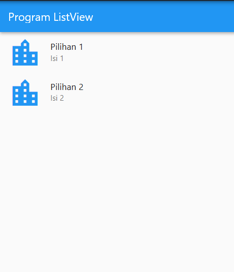

## LISTVIEW

Listview merupakan wiget yang digunakan untuk menampilkn data secara dynamis, serta dapat juga menmpilkan data dari array dan sumber lain seperti database dengan menggunakan perintah yang tersimpan daam json.
dalam artikel ini kita akan coba step by step mempraktekan lisview, Langkah pertama siapkan terlebih dahulu class yang dijadikan tempat meletakkan ListView
>## Program Dasar
```dart
import 'package:flutter/material.dart';

void main() => runApp(MyApp());

class MyApp extends StatelessWidget {
  Widget build(BuildContext context) {
    return MaterialApp(
      home: Scaffold(
        appBar: AppBar(
          title: Text('Program ListView'),
        ),
        //Program Lisview
      ),
    );
  }
}

```
>## Contoh Mebuat ListView Sederhana
perintah dibawah ini menggunkan item padding

```dart
        body: ListView(
        children: <Widget>[
          Padding(
            padding: EdgeInsets.all(8.0),
            child: Text("Android Cupcake",style:TextStyle(fontSize:20.00,)),
          ),
          Padding(
            padding: EdgeInsets.all(8.0),
            child: Text("Android Donus"),
          ),
          Padding(
            padding: EdgeInsets.all(8.0),
            child: Text("Android Eclair"),
          ),
          Padding(
            padding: EdgeInsets.all(8.0),
            child: Text("Android Froyo"),
          ),
          Padding(
            padding: EdgeInsets.all(8.0),
            child: Text("Android Gingerbread"),
          ),
          Padding(
            padding: EdgeInsets.all(8.0),
            child: Text("Android Honeycomb"),
          ),
          Padding(
            padding: EdgeInsets.all(8.0),
            child: Text("Android Ice Cream Sandwich"),
          ),
          Padding(
            padding: EdgeInsets.all(8.0),
            child: Text("Android Jelly Bean"),
          ),
          Padding(
            padding: EdgeInsets.all(8.0),
            child: Text("Android Jelly Bean"),
          ),
        ],
      ),
      
```
Hasilnya:

>## ListView dengan textile
Gunakan perintah yang paling atas pada body masukkan perintah dibawah
```dart
        body: new ListView(children: [
          ListTile(
            leading: Icon(Icons.location_city, size: 60.00, color: Colors.blue),
            title: Text("Pilihan 1"),
            subtitle: Text("Isi 1"),
          ),
          ListTile(
            leading: Icon(Icons.location_city, size: 60.00, color: Colors.blue),
            title: Text("Pilihan 2"),
            subtitle: Text("Isi 2"),
          ),
        ]),
        
```


>##Lisview dengan Builder
dalam hal ini proses pembuatan listview menggunkan sumber data yang berasal dari array
berikut perintah Lengkapnya:
```dart

import 'package:flutter/material.dart';

void main() => runApp(MyApp());

class MyApp extends StatelessWidget {
  Widget build(BuildContext context) {
    return MaterialApp(
      home: Scaffold(
        appBar: AppBar(
          title: Text('Program ListView'),
        ),
        body: new ListView(children: [
          ListTile(
            leading: Icon(Icons.location_city, size: 60.00, color: Colors.blue),
            title: Text("Pilihan 1"),
            subtitle: Text("Isi 1"),
          ),
          ListTile(
            leading: Icon(Icons.location_city, size: 60.00, color: Colors.blue),
            title: Text("Pilihan 2"),
            subtitle: Text("Isi 2"),
          ),
        ]),
      ),
    );
  }
}

class Tampil extends StatefulWidget {
  _Tampil createState() => _Tampil();
}

class _Tampil extends State<Tampil> {
  var data = [
    {'judul': 'Judul1', 'isi': 'isi1'},
    {'judul': 'Judul3', 'isi': 'isi3'}
  ];

  @override
  Widget build(BuildContext context) {
    return Scaffold(
        body: new ListView.builder(
            itemCount: data.length,
            itemBuilder: (context, i) {
              return ListTile(
                leading:
                    Icon(Icons.location_city, size: 60.00, color: Colors.pink),
                title: Text('${data[i]['judul']}'),
                subtitle: Text('${data[i]['isi']}'),
              );
            }));
  }
}

```

